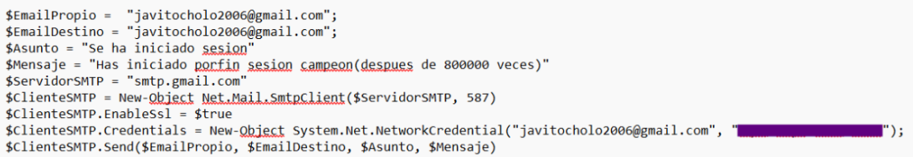

# Sistema de Copias de Seguridad Automatizadas Multicapa

## 1. Arquitectura General del Sistema

- Nivel 1: En este primer nivel, cada equipo realizará de forma independiente una copia de seguridad de sus datos y configuraciones, utilizando su propio sistema operativo (Linux, Windows o macOS). Para ello, se podrán usar herramientas comunes como Duplicati o soluciones específicas para cada plataforma.
  La copia de seguridad se generará en formato ISO y se almacenará en una carpeta local. Esta carpeta tendrá un nombre identificativo que incluya el nombre del equipo y la fecha en la que se ha realizado el backup, con el objetivo de mantener un orden y facilitar futuras restauraciones.
  

- Nivel 2: En este segundo nivel, la carpeta generada en el nivel anterior que contiene el archivo ISO con el respaldo completo se transferirá a un servidor central, un equipo designado o un dispositivo NAS. Este repositorio centralizado almacenará las copias de seguridad de todos los equipos, organizadas en subcarpetas individuales para cada uno de las backups de los equipos, respetando la misma convención de nombres, con el fin de asegurar una correcta trazabilidad y acceso.Para aumentar la seguridad e integridad de los datos almacenados, se recomienda que el servidor central o NAS utilice una configuración de almacenamiento RAID 5. Este tipo de RAID distribuye los datos y la paridad entre varios discos, lo que permite que, en caso de fallo de uno de ellos, la información pueda recuperarse sin pérdida de datos. Así nos garantizamos una mayor tolerancia a fallos y disponibilidad del sistema de backups.
  

- Nivel 3: Por último, en este tercer nivel, el repositorio central que almacena todas las copias ISO será respaldado en un sistema de almacenamiento en la nube. Este nivel está diseñado para garantizar la continuidad de la empresa ante situaciones críticas, como desastres físicos (por ejemplo, un incendio en la empresa). Al tener una copia de seguridad externa en la nube, se añade una capa adicional de seguridad y tranquilidad, asegurando que los datos puedan recuperarse incluso si los niveles anteriores se ven comprometidos.

---

## 2. Configuración del Nivel 1: PCs Individuales

### a. Selección de software

- Windows: Windows: Duplicati, una herramienta gratuita y de código abierto la cual ofrece copias de
  seguridad cifradas, comprimidas, automáticas e incrementales, con una interfaz web fácil de usar
  y compatibilidad con almacenamiento local, en red y en la nube.
  ● Es una herramienta gratuita y open source.
  ● Realiza copias de seguridad cifradas y comprimidas.
  ● Permite hacer backups automáticos e incrementales en la nube o en servidores remotos.
  ● Cuenta con una interfaz web fácil de usar.
  ● Es compatible con carpetas locales, discos duros externos, servidores en red y servicios
  en la nube.
  ● Se puede programar con gran flexibilidad (diaria, semanal, etc.).
  

- macOS: macOS: Time Machine, herramienta nativa de macOS, que realiza copias de seguridad
  automáticas e incrementales cada hora en unidades de almacenamiento externas o de red,
  destacando por su sencillez y la capacidad de restaurar archivos individuales o el sistema
  completo.
  ● Es gratuito y viene preinstalado en todos los Mac.
  ● Tiene una interfaz sencilla.
  ● Realiza copias de seguridad incrementales automáticas cada hora.
  ● Permite restaurar archivos individuales o el sistema completo desde una fecha específica.
  ● Es compatible con discos duros locales o en red (Time Capsule, servidores NAS
  compatibles).
  ● Almacena múltiples versiones de archivos, ideal para la recuperación por error del
  usuario.
  

- Linux: Linux: rsync, es una herramienta de línea de comandos para copias de seguridad y sincronización
  de archivos, eficiente por transferir solo los cambios. Ofrece compresión, cifrado mediante SSH,
  sincronización bidireccional y es fácilmente programable.
  ● Compresión: Soporta la compresión de datos durante la transferencia para reducir el uso
  de ancho de banda.
  ● Seguridad: Permite el cifrado con SSH para transferencias seguras.
  ● Sincronización bidireccional: Puede mantener dos directorios sincronizados entre sí.
  ● Programación fácil: Se puede automatizar con cron o tareas programadas.
  ● Detección de errores: Asegura que los archivos copiados sean exactos mediante un
  mecanismo de verificación.
  ● Transfiere solo los cambios realizados en los archivos, lo que la hace rápida y eficiente.
  ● Es ideal para backups locales o remotos

### b. Programación de copias

Hablemos y escogeremos Duplicati, debido a que anteriormente lo he tratado. Duplicati como la
actividad hemos comentado Duplicati es una herramienta gratuita y open source para realizar
copias de seguridad automáticas, cifradas y comprimidas. Es compatible con múltiples
plataformas y permite almacenar los datos en la nube o servidores remotos.

- ¿Cómo se configuran las copias incrementales diarias?
  
  

  
  Para configurar las copias incrementales diarias en Duplicati, primero debemos abrir el programa y
  crear una nueva tarea de copia de seguridad. En la configuración de esta tarea, accederemos al
  apartado de "Horario", donde activaremos la opción "Ejecutar automáticamente". A continuación,
  seleccionaremos el horario en el que deseamos que se ejecute la copia, asegurándonos de elegir un
  momento que no interfiera con el rendimiento de la red o los recursos del sistema, ya que durante la
  ejecución de Duplicati, el uso de la CPU y el tráfico de red aumentarán. Después, en el apartado de
  Tipo de copia de seguridad, seleccionaremos la opción Incremental para que sólo se respalden los
  archivos modificados desde la última copia. Finalmente, configuraremos la tarea para que se ejecute
  de manera diaria, lo que garantizará que las copias incrementales se realicen automáticamente cada
  día sin necesidad de intervención manual.
  
  

- ¿Cómo se hacen las copias completas semanales?
  
  

  
  Para programar copias completas semanales en Duplicati, primero abrimos el programa y nos
  dirigimos a la ventana de “Horario”. Ahí, configuramos una nueva tarea de copia de seguridad,
  seleccionando la opción Semanal. Elegimos el día de la semana en que queremos realizar la copia
  completa, como por ejemplo, todos los domingos. Luego, definimos una hora para que se ejecute la
  copia, preferentemente en un horario de baja actividad, como a las 2:00 AM, para minimizar el
  impacto en el rendimiento del sistema. Nos aseguramos de seleccionar el tipo de backup como
  Completa, para que se respalden todos los archivos, no solo los modificados. Con esta configuración,
  las copias de seguridad completas se realizan de forma automática cada semana, asegurando que se
  conserve una copia íntegra de todos los archivos.

### c. Destino de las copias

- ¿Dónde se almacenan?
  

  Las copias ISO se almacenan en un servidor central o NAS, al que se accede mediante la red local.
  

- ¿Cómo se organizan las carpetas por PC?
  

  Las copias se organizan en subcarpetas dentro del servidor, usando un nombre que incluye el nombre del equipo y la fecha (por ejemplo: PC-Miguel_angel-05-08), lo que permite una trazabilidad clara y ordenada.

---

## 3. Configuración del Nivel 2: Servidor Local Primario

### a. Tipo de hardware elegido

- Opción: Para este caso un NAS es la elección superior y más profesional, para la mayoría de los usuarios y pequeñas empresas que buscan un destino de copia de seguridad local que sea fiable, fácil de configurar y mantener y por supuesto, eficiente en cuanto a energía.
  Su diseño específico para el almacenamiento en red y la gestión de copias de seguridad simplifica muchísimo el uso de esta capa crítica de la estrategia de copia de seguridad.
  
  

- Marca/modelo (si aplica): **Synology DiskStation DS224+**
  
  

- Sistema operativo: Btrfs: sistema de archivos avanzado para la protección de datos. El sistema operativo Synology DiskStation Manager (DSM) que impulsa el DS224+ utiliza el sistema de archivos Btrfs avanzado, que protege sus datos contra la corrupción y permite revertir cambios no deseados o maliciosos mediante el uso de la tecnología de instantáneas.
  
  

  
  

### b. Tipo de RAID

- Elegido: RAID 1
- Justificación: Nuestra elección de RAID 1 para la configuración final para el Servidor Local Primario se basa principalmente, para este nivel crítico de almacenamiento, en la fiabilidad absoluta, la simplicidad para operar y la garantía de una recuperación exitosa y segura ante un posible fallo de disco.
  Teniendo en cuenta que sacrificamos un poco la eficiencia de almacenamiento en comparación a RAID 5, conseguimos destacar también nuestras ventajas que son las siguientes: menor complejidad de uso, mayor velocidad y seguridad del proceso de reconstrucción y excelente rendimiento de lectura. Estas características destacables lo convierten en la opción más robusta y prudente para asegurar la copia de seguridad local esté siempre disponible y sea posible su recuperación con el mínimo riesgo.
  Es una elección que, en general, prioriza la seguridad y la simplicidad en un componente esencial de la estrategia de recuperación de posibles desastres.

Guía:

* ¿Qué ventaja ofrece frente a un solo disco?

La principal ventaja que destacamos de usar RAID 1 frente a un solo disco es la redundancia y la tolerancia a fallos. Si usasemos un solo disco y fallase, perderíamos todos nuestros datos e información (a menos que haya otra copia en otro lugar, que es precisamente lo que este servidor pretende ser).

En cambio lo bueno que tiene el RAID es que si uno de los discos falla, los datos siguen siendo accesibles desde los discos restantes, consiguiendo que se reemplace el disco defectuoso sin perder información y reconstruir la estructura de datos(array) a su estado redundante.

### c. Software de gestión

- Software elegido: **Veeam Backup & Replication**
- Función principal:
  1. Instalar el software: Primero instalamos el programa en el ordenador o servidor que tiene los datos que quieres proteger la "Fuente".
  2. Creamos una "Tarea" de Backup: Abrimos el software y le dicimos que nos interesa configurar una nueva tarea de copia de seguridad.
  3. Iniciamos la primera Backup: Una vez configurada, podemos iniciar la primera copia manualmente para que empiece a trabajar. Las siguientes se harán solas según la programación que tenga.
  4. Verificamos que se hacen las copias: Es importante que supervisemos periódicamente el software para asegurarnos de que las tareas se completan sin errores y que las copias se están guardando correctamente en el destino correcto.
  5. Restauramos los datos: Si alguna vez se pierde un archivo o necesitamos volver a una versión anterior, abrimos el software, buscamos la tarea de “backup” que contiene esos datos, seleccionas los archivos o carpetas que queremos recuperar y elegimos dónde queremos que se restauren (normalmente en su ubicación original o a una nueva).

---

## 4. Configuración del Nivel 3: Servidor Secundario Remoto

### a. Tipo de servidor remoto

- Opción elegida: Nube (Google Cloud, Azure o AWS)
  
  

  
  
- Justificación: La nube garantiza que los datos se almacenen en una ubicación física separada del
  servidor local, lo que es crucial en caso de incidentes catastróficos (incendios,
  inundaciones, etc.).
  Ofrece escalabilidad, alta disponibilidad y, en muchos casos, integraciones automatizadas
  para la sincronización de datos

### b. Seguridad de la sincronización

- ¿Cómo se programa la sincronización?
  
  Se programa atreaves de servicios nativos de la nube como es Google Cloud, herramientas del sistema operativo como rsync o software de terceros especializado que nos permiten configurar tareas recurrentes con diferentes frecuencias y filtros.
  
  

- ¿Qué cifrado se usa?
  
  Las nubes principales cifran los datos en reposo osease cuando ya estan almacenados por defecto, normalmente con AES-256. También cifran los datos en tránsito osease durante la transferencia de los datos usando protocolos seguros como SSL/TLS pero tambien hay opciones adicionales para gestionar nuestras propias claves de cifrado si lo necesitasemos.
  
  

- ¿Se puede activar doble autenticación?
  
  Sí ademas de que es altamente recomendable y encima es posible activar la autenticación multifactor para las cuentas de usuario que gestionan y acceden a los recursos de almacenamiento en la nube. Esto nos añade una capa de seguridad pidiendo una segunda verificación además de la contraseña para iniciar sesión, protege el acceso a la configuración y administración, aunque la sincronización automática use métodos de autenticación de servicio diferentes.

---

## 5. Automatización del Proceso

- Script de verificación:
  
  
- Alerta por email: ¿Cómo se configura?
  Hay varias posibilidades a la hora de configurar la alerta por email, pero nos hemos basado en una práctica que realizamos anteriormente y hemos hecho una captura del codigo que usamos en el script para que nos envie la alerta.
  
  
  
- Prueba de restauración: ¿Cada cuánto tiempo? ¿Cómo?
  Pruebas de Restauración a Nivel de Archivo/Carpeta: Se recomiendan hacer con bastante frecuencia basicamente cada semanalmente o mensualmente si no quieres ser tan frecuente. Son rápidas y confirman que los backups básicos de archivos están funcionando.
  
  

  
  Pruebas de Restauración de Sistema Completo o Máquina Virtual: Estas son más complejas y requieren más tiempo y recursos. Se suelen realizar con una frecuencia trimestral o semestral, hablamos mas o menos de cada 3 o 6 meses.

---

## 6. Justificación del uso de RAID

- ¿Por qué no sustituye al backup?
  
  El RAID nos protege contra la pérdida de datos causada por el fallo físico de uno o varios discos duros, manteniendo la disponibilidad del sistema al distribuir o duplicar la información entre ellos pero el RAID no es una solución de copia de seguridad porque no nos protege contra la corrupción lógica de datos, el borrado accidental de archivos, los ataques de malware o ransomware que cifran o eliminan información, ni desastres que afecten al servidor completo o su ubicación física. En resumen el RAID mantiene la redundancia de los datos actuales, mientras que un backup crea una copia histórica e independiente de los datos para permitir la recuperación ante cualquier evento que no sea simplemente un fallo de disco.
  
  

- ¿Qué pasa si solo tenemos RAID?
  
  Si ocurre cualquiera de los escenarios anteriores como borrado accidental, ransomware, fallo total del servidor, etc... , perderiamos nuestros datos irremediablemente aunque el array RAID esté técnicamente "sano" o los discos individuales funcionen, los datos dentro del array se habrian borrado, corrompido o vuelto inaccesibles. El RAID no tiene "memoria" de versiones anteriores de tus archivos ni puede revertir cambios lógicos o externos; solo mantiene la estructura de datos actual redundada entre los discos.

---

## 7. Resumen de Software Recomendado

| Función                        | Software Recomendado     |
|-------------------------------|--------------------------|
| Gestión centralizada          | Urbackup, Veeam B&R                         |
| Sincronización entre servidores| Rclone, Duplicati                      |
| Monitorización                | Nagios, Zabbix                       |
| Clientes Windows              | Veeam Agent Free                         |
| Clientes Linux                | Timeshift + rsync                         |
| Almacenamiento NAS            | Synology Hyper Backup                         |

---

## Bibliografía / Fuentes consultadas

- Fuente 1: [link software de back ups](https://www.techradar.com/best/best-backup-software)
- Fuente 2: [mejores softwares de backup elegidos por usuarios](https://www.g2.com/categories/backup)
- Fuente 3: [Software backups](https://en.wikipedia.org/wiki/List_of_backup_software)
- Fuente 4: [Raid de discos duros, todo lo que necesitas saber](https://computerhoy.20minutos.es/pc/raid-beneficios-pc-1370709)
- Fuente 5: [especificaciones en página oficial del # DiskStation DS224+](https://www.synology.com/es-es/products/DS224+#specs)
- Fuente 6: [Pagina oficial de Veeam Backup & Replication](https://helpcenter.veeam.com/docs/backup/vsphere/ui.html?ver=120)
- Fuente 7: [Video tutorial de Veeam Backup & Replication](https://www.youtube.com/watch?v=tEgv9BopM1E)
- Fuente 8: [Para elegir el raid](https://www.tecnozero.com/servidor/tipos-de-raid-cual-elegir/)
- Fuente 9: [Para elegir el raid 2](https://www.westerndigital.com/es-es/solutions/raid#:~:text=Las%20matrices%20RAID%20reparten%20las,uno%20de%20los%20discos%20falle)

